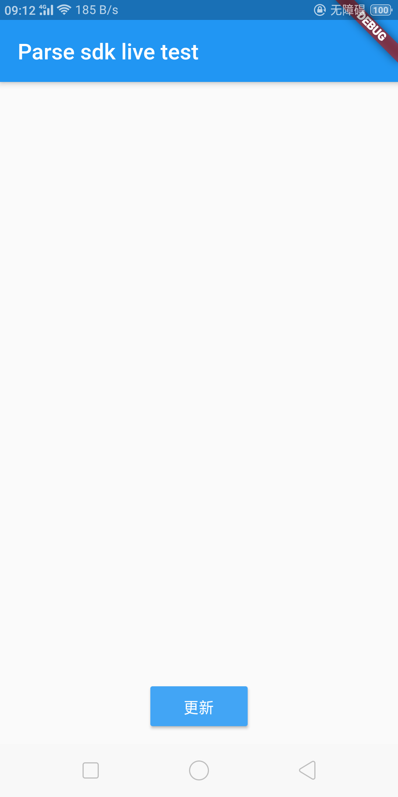
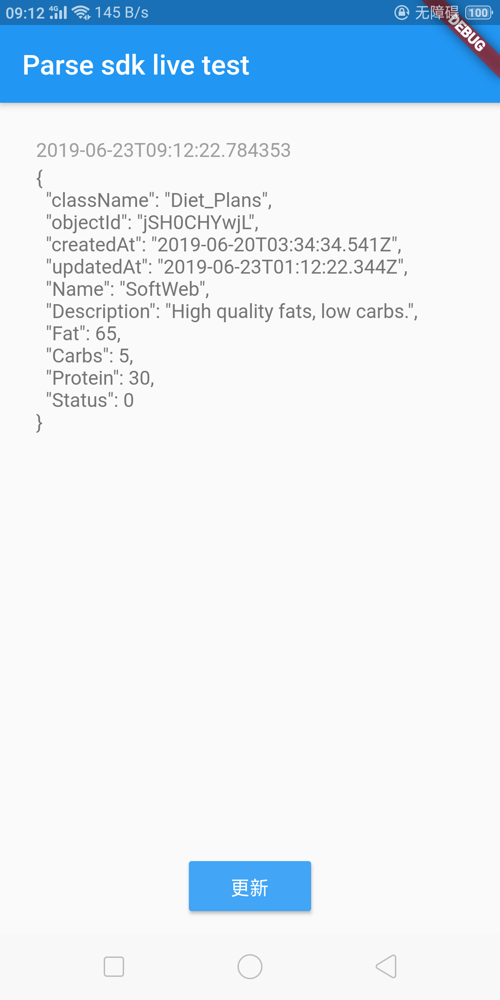

# flutter_ParseServer_example

Demonstrates ParseServer sdk.
## 连接 docker server
[docker-compose-parse-server](https://github.com/unreal0/docker-compose-parse-server).

## demo
* live parse demo
* data add/delete/change/find
